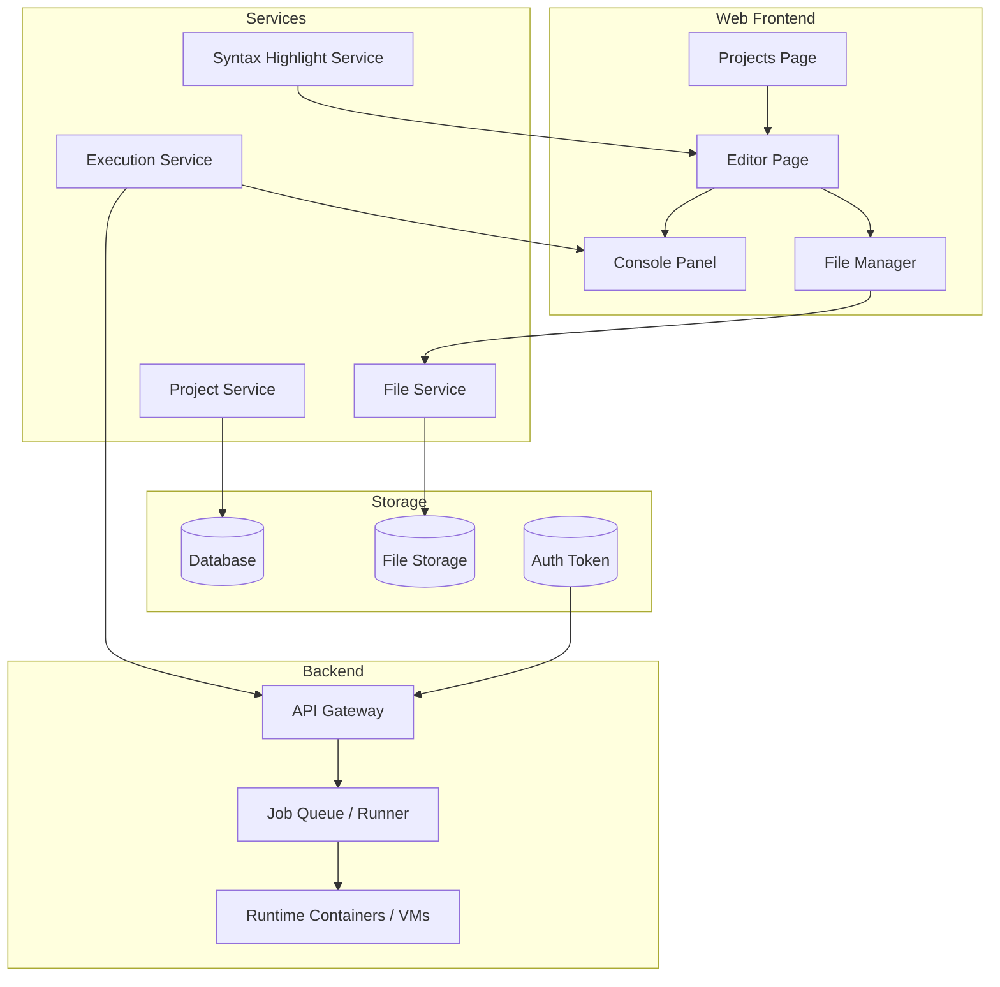

# ios-code-space

A public web-based coding environment inspired by Termux.

## Goal
Build a lightweight website where users can create, edit, organize, and run code from any device, including iPhone and iPad, without relying on a native iOS app.

## MVP
- Project list
- Code editor
- File manager
- Console/output panel
- Run code via backend execution service
- Basic syntax highlighting

## High-level architecture
- **Frontend**: Next.js / React
- **Editor**: Monaco Editor or CodeMirror
- **Console**: terminal-style output panel
- **Backend**: Node.js API
- **Execution**: Docker or isolated runner service
- **Storage**: database + file storage

## Mermaid diagram

## Suggested stack
- Next.js
- React
- TypeScript
- Monaco Editor
- Node.js backend
- PostgreSQL or SQLite for metadata
- S3-compatible storage for files

## Next steps
1. Scaffold the web app
2. Add editor and project UI
3. Implement backend execution API
4. Add authentication and persistence
